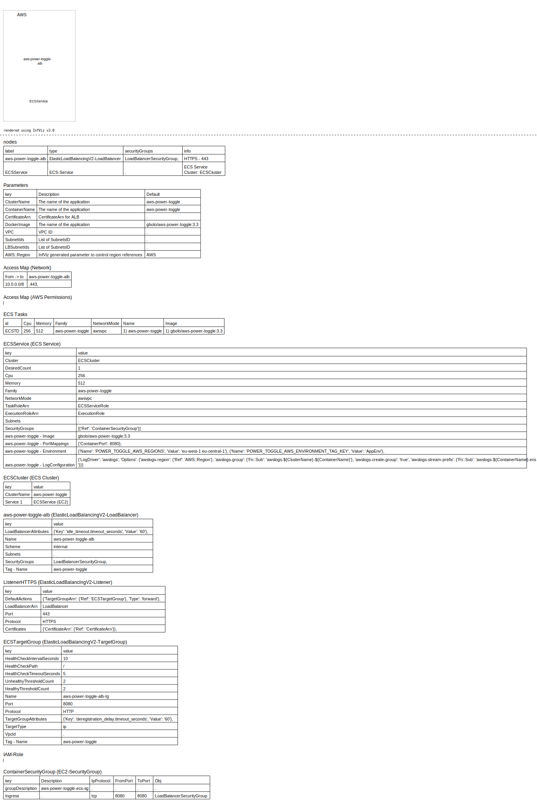

# CloudFormation Example

## **USE AT YOUR OWN RISK**

### Requirements

* VPC
* LB subnet
* Internal subnet

### Creates

* Creates an ECS Cluster
* Creates an ECS Service and TaskDefinition using FARGATE_SPOT
* Creates a (non-internet facing) ALB, Listener in port 443 and TargetGroup attached to the ECS Service.

### Costs

This costs cover only the ALB, ECS Service is unknown but it's configured with the cheapest service (Spot and minimum cpu and memory).

It logs to cloudwatch logs so expect some costs there also.

**Track in Cost Explorer the Tag: `{Name: aws-power-toggle }`**

### Infviz CF Report

